# Geospatial Web Lab

**Illustrated feature and workflow report**

Documentation edition: September 29, 2026. Application baseline: `72205d5c0ad9fdcdf90c929e0b506c3280f7bf5f`.

This report explains the implemented features of five working geospatial web applications, with 21 screenshots captured from their local browser interfaces. Each chapter covers the purpose of the app, its controls, the normal workflow, permissions, background operations, validation, exports, and recovery behavior. Screenshot pages follow each application's feature explanation. The shared sign-in screen appears after the architecture chapter.

The applications are an AI-assisted learning and portfolio project. All operational records, people, vehicles, parcels, infrastructure assets, and elevations are synthetic. Real basemaps supply geographic context. The examples demonstrate software behavior, not municipal operations, field measurements, regulatory conclusions, or measured business impact.

The PDF uses portrait pages for explanations and landscape pages for screenshots. Its bookmarks provide navigation to chapters and topics. The Markdown edition retains the same explanations and full-resolution image files. Screenshots are actual browser captures, not design mockups or generated illustrations.

## Reading guide

| Application | Main workflow | Skills demonstrated |
| --- | --- | --- |
| Civic Works | Report, locate, assign, resolve, import, export | Rails CRUD, ownership, state transitions, live updates, PostGIS distance |
| Data quality portal | Upload, validate, review, approve, download | Geometry validation, background ingestion, review decisions, immutable snapshots |
| Fleet monitor | Replay, inspect routes, manage zones, trace transitions | Ordered telemetry, real-time maps, spatial membership, bounded history |
| Parcel scenarios | Select land, set assumptions, calculate, compare, export | Geodesic areas, explicit formulas, asynchronous calculations, private results |
| Infrastructure inspections | Explore 3D assets, report conditions, resolve, profile | CesiumJS, linked measurements, audit history, geodesic sampling |

1. [Civic Works: service-request operations](#1-civic-works-service-request-operations)
2. [Geospatial data-quality portal](#2-geospatial-data-quality-portal)
3. [Fleet and geofence monitor](#3-fleet-and-geofence-monitor)
4. [Parcel scenario explorer](#4-parcel-scenario-explorer)
5. [Infrastructure inspections](#5-infrastructure-inspections-condition-records-in-a-3d-corridor)
6. [Shared architecture, permissions, and evidence](#6-shared-architecture-permissions-and-evidence)
7. [Reproduction and screenshot provenance](#7-reproduction-and-screenshot-provenance)

<!-- pagebreak -->

## 1. Civic Works: service-request operations

**Visual references: Figures 01-04 follow this chapter.**

Civic Works connects a reported problem, its geographic position, the staff member responsible for it, and its progress toward resolution. The example service area is near Lewisville, Texas. Requests, people, assignments, and imported records are synthetic. The application does not connect to a municipal work-order system.

The frontend runs on port 5171 and its Rails API on 3101. A reporter can create requests and read their own records. Staff can see all requests, assign work, change lifecycle states, and use imports and reports. The additional `crew@example.test` staff account supports a second, independent editing session.

### Overview, counts, and workspace navigation

The header identifies the signed-in account and offers **+ New request** and sign-out. Four summary cards show matching requests, requests awaiting assignment, active work, and resolved work. Active work combines assigned and in-progress requests. Every count follows the current search, status, category, and distance criteria. A reporter's counts only include their own requests.

**Request workspace** contains filters, the map, selected-request details, the register, and a status chart. Staff also see **Imports & reports**. Switching views changes the interface without changing the underlying records. A live-connection indicator distinguishes connected WebSocket delivery from an offline connection; the adjacent recovery-sync label states the 15-second polling interval.

The **Requests by status** bar chart summarizes the four lifecycle states within the current filters. It is a workload count, not a measure of response time or service quality. Matching counts cover the complete filtered result, while the map and register contain at most the latest 500 matches, ordered by their update time. A truncation message makes that difference explicit.

### Search, category, status, and distance filters

**Search requests** searches titles and descriptions without case sensitivity. A short typing delay avoids issuing a request for every keystroke. **Status** narrows the workspace to new, assigned, in progress, or resolved work. **Category** selects roads, lighting, drainage, or parks. These criteria combine rather than replace one another.

**Distance filter** expands a form for center latitude, center longitude, and radius in meters. **Apply distance** uses PostGIS geography distance, with a supported radius from 1 to 100,000 meters. Latitude must be between -90 and 90 and longitude between -180 and 180. This is straight-line geographic proximity, not a road-network travel distance. The interface marks an active distance condition. **Clear distance** removes that condition; **Reset** clears the complete set of filters.

The ArcGIS map displays color-coded request markers and a legend for the four states. Zoom buttons and normal map navigation support location inspection. Selecting a marker or a register title opens the same detail panel and highlights the corresponding selection. The register shows request number and title, category, status, assignee, and last update. Empty results display a clear message. The basemap and ArcGIS assets require external services even though application records are stored locally.

### Create a request and inspect its details

**+ New request** opens a dialog with title, category, description, latitude, and longitude. Title is required and limited to 160 characters; description is optional and limited to 5,000. Coordinates use WGS84 decimal degrees. The dialog initially provides a nearby synthetic location, which should be changed when demonstrating another position. Location is entered numerically; this form does not offer address geocoding or map-click placement.

**Create request** sends the form to Rails for validation and persistence. The saving state prevents repeated submission, and a validation failure appears in the dialog. On success the dialog closes, filters reset, and the new request becomes the selection. **Close**, or the dialog's normal dismissal behavior, abandons an unsaved form.

The detail panel shows the numbered request, status, title, description, category, reporter, assignee, created and updated times, and coordinates. A resolution time appears when the request is resolved. Missing descriptions and unassigned work have explicit fallback labels. This view lets a reporter inspect progress without exposing management controls.

### Assign work, progress it, and handle concurrent edits

Staff choose an account from **Staff member** and save the assignment. Assigning a new request also moves it into assigned status. The normal sequence is `new -> assigned -> in_progress -> resolved`. Work in progress can return to assigned; resolved work can reopen to in progress. The status selector only offers the current state and permitted next states. A staff assignment is required once a request leaves new status, and Rails rejects nonstaff assignees or invalid transitions.

**Save changes** persists the assignee and status together. The visible management form edits these operational fields. The API additionally permits validated staff changes to title, description, category, and coordinates, but the interface does not include a general edit form for those fields. Resolving records a timestamp; reopening clears it.

Every staff update carries the record's `lock_version`. If another staff member saves first, the older draft cannot silently overwrite the new state. The panel shows a conflict notice and disables saving until **Load current values** refreshes the draft. A simultaneous change that reaches the server before the live notification is also rejected with an HTTP 409 response. Separate browser sessions are needed for a realistic two-user demonstration; ordinary tabs share the same login cookie.

### Import Point features and inspect rejected rows

The staff-only **Imports & reports** view includes **Download example**, a GeoJSON file chooser, recent imports, and import progress. The example contains two synthetic requests. Imports accept a FeatureCollection with 1 to 500 Point features, subject to the 2 MB limit. Each feature needs a title. Category can be roads, lighting, drainage, or parks and defaults to roads when omitted. Description is optional. Point coordinates supply longitude first and latitude second; this importer uses the first two numeric components. The separate data-quality application applies a stricter two-component rule.

Uploading creates a background run. Cards show pending, processing, completed, or failed state, imported and rejected totals, processed versus total rows, a progress bar, and creation time. The list shows the latest 15 imports owned by the current staff account. **Review rejected rows** expands row numbers and validation messages. Invalid rows do not prevent valid rows from being imported, and completed therefore does not necessarily mean every row passed. Progress commits every 25 rows and at completion.

Re-uploading the same serialized content under the same staff account reuses its import run. Each imported feature also has a stable source key, and job locking prevents duplicate execution from multiplying records. **Retry import** appears for a failed processing run and reuses already imported rows. Correcting invalid source data requires a new upload; retrying does not repair it. Queue failures remain visible instead of leaving an unexplained pending operation.

### Generate a CSV and understand live recovery

**Generate CSV report** queues a complete export of requests visible to that staff account. It includes every request regardless of the current workspace filters. Report cards show state, creation time, and row count; completed cards offer **Download CSV**. The interface lists the latest 10 reports owned by the signed-in account, and only the requesting staff member can download each report.

Columns include ID, title, category, status, latitude, longitude, reporter, assignee, creation time, and resolution time. Descriptions are not included. Text that starts with spreadsheet formula prefixes is neutralized. A report is built from records when the worker runs; it is not a transactionally frozen snapshot of the moment the button was clicked. A failed export may recover through automatic retries; otherwise create a new report. There is no manual export-retry button.

Committed changes notify staff and the original reporter through server-selected ActionCable streams. Reconnection and the 15-second poll refresh authoritative API state after missed events. An update-notification outage does not undo a successful database write. Database-backed CSV storage, bounded map results, and bounded job lists suit this learning application; large operational exports, retention, and production-scale monitoring would require additional work.

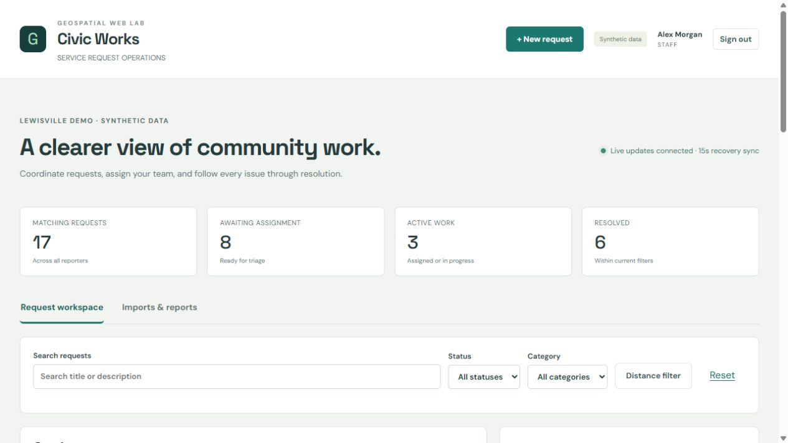

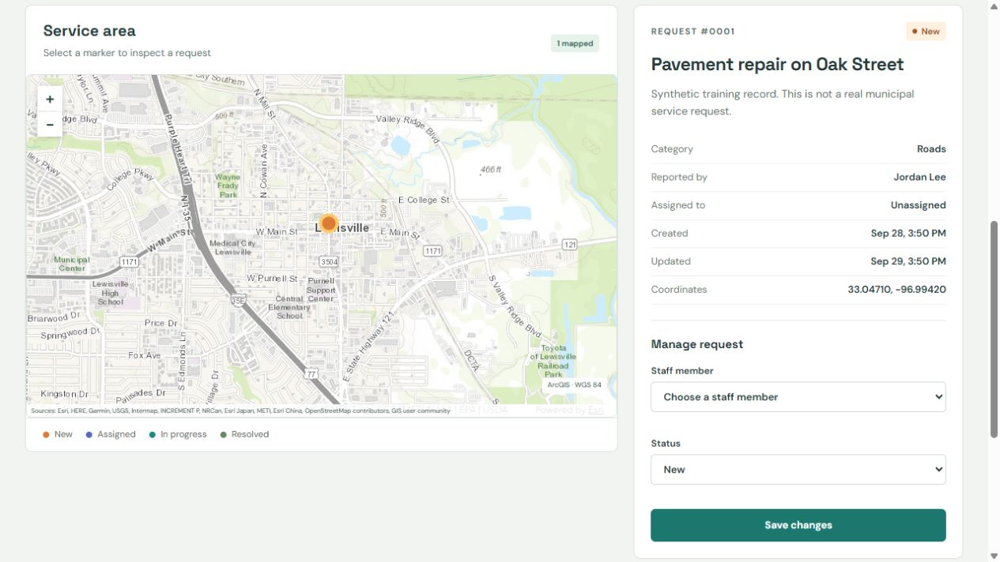

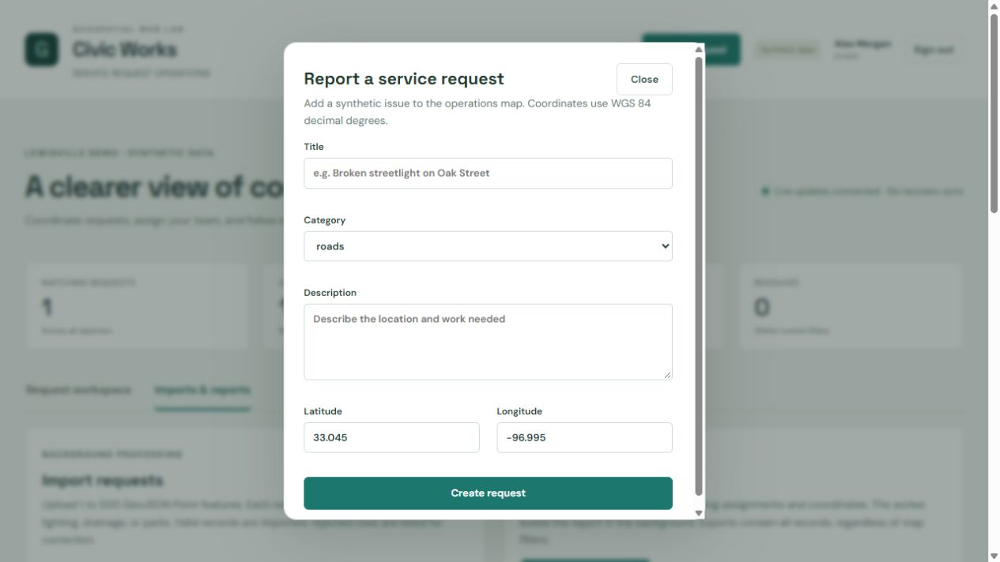

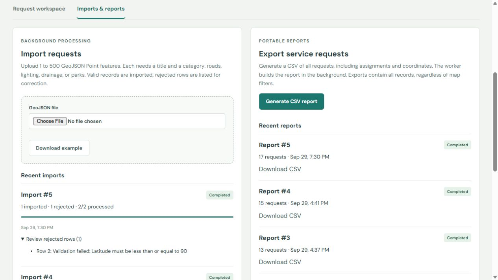

## 2. Geospatial data-quality portal

**Visual references: Figures 05-09 follow this chapter.**

The data-quality portal turns a GeoJSON file into a reviewed dataset and, after staff approval, a stable export. Its main distinction is between a source record, the result of validation, and the approved snapshot. Rejected records remain available to explain what was excluded. The application does not silently repair geometry or treat an accepted feature as independently verified real-world data.

The frontend runs on port 5172 and the Rails API on 3102. Reporters can upload and inspect their own datasets. Staff can inspect all datasets and approve valid features. Every dataset access, retry, approval, and export is checked by the backend. Bundled park inventories and their deliberately erroneous examples are synthetic.

### Dataset library, status, and quality indicators

The **Dataset library** lists accessible uploads with their name, processing status, feature count, and owner. Selecting a dataset opens its summary, accepted geometry preview, and record review. The current selection is highlighted. With no uploads, the library gives an upload prompt; while details are being fetched it shows a loading state.

Four summary cards count accessible datasets, datasets awaiting review, approved datasets, and rejected features. The library API returns the latest 100 accessible datasets, so these cards summarize that returned set rather than an unlimited historical collection. A dataset's detailed summary identifies its required attributes and separates accepted and rejected counts in a bar chart. The percentage is accepted features divided by processed features, rounded to a whole number. During validation it is a progress-related result, not a prediction of the final pass rate.

The lifecycle has five states: **In queue**, **Validating**, **Ready for review**, **Approved**, and **Processing failed**. Queued and validating states display processed versus total features and a progress bar. Ready for review means validation finished; it does not imply approval or even that any feature passed. An all-rejected dataset can finish validation successfully while remaining ineligible for approval.

### Choose a file and configure its validation rules

**Upload GeoJSON** opens the upload form; **Close upload** collapses it. A drag-and-drop area and file chooser provide equivalent file selection. Accepted file extensions include JSON and GeoJSON. The interface displays the selected filename and fills an editable dataset name from it, replacing filename separators with spaces. Names are required and limited to 120 characters.

**Required attributes, comma separated** supplies the attribute keys that every feature must contain. The default is `asset_id`. Each required value must be present and nonblank; the rule does not assert uniqueness, a numeric type, or a specific vocabulary. A blank rule list allows no required keys, although feature properties must still be an object. The server trims and deduplicates keys, permits at most 10, and requires each name to start with a letter or underscore followed by letters, digits, or underscores, to a maximum length of 50.

**Upload and validate** is enabled when a file has been successfully read and no operation is busy. Invalid JSON or an oversized file produces a visible error. Selecting an invalid replacement clears the previous upload payload, preventing accidental submission of the earlier file. The application sends file content to Rails as a source string within JSON rather than as a separately stored multipart upload.

Input must be a FeatureCollection with 1 to 2,000 features, at most 5 MB. The backend repeats the essential checks rather than trusting the browser. When the upload succeeds, the form closes and the new dataset is selected. An equivalent upload by the same account instead opens the existing dataset and explains that no duplicate records were created.

### Understand geometry and attribute findings

Six geometry types are supported: Point, MultiPoint, LineString, MultiLineString, Polygon, and MultiPolygon. Coordinates must use WGS84 longitude and latitude, with exactly two finite numeric components per position. Longitude must be between -180 and 180; latitude between -90 and 90. Three-dimensional positions, GeometryCollection, null geometry, missing geometry, and empty components are rejected explicitly.

A LineString needs at least two positions. Polygon rings need at least four positions and identical first and last positions. Multi-geometries must contain valid members. After structural checks, PostGIS parses otherwise eligible geometry and checks topology, including polygon self-intersections. Database constraints also prevent an accepted record from being stored without valid geometry. If attribute checks already fail, the record can show those findings without reaching later topology checks; validation findings are not necessarily an exhaustive list of every possible defect in the original feature.

No projection transformation, coordinate-order guessing, geometry repair, duplicate-feature detection, or external truth comparison occurs. The bundled reversed-coordinate example fails its latitude range. A reversed coordinate pair that remains within both legal ranges cannot be identified merely from those range checks. Likewise, a nonblank identifier can pass even if another feature uses the same value. These boundaries are important when interpreting the acceptance percentage.

### Review individual records and their original source

**Accepted feature preview** maps only features that pass the configured checks. The initial view is calculated from their coordinates. ArcGIS zoom buttons and map navigation help inspect individual locations. With no accepted geometry, an explanatory empty state replaces the map. An external basemap provides context but does not validate the source features.

**Record review** includes row number, asset identifier and name, geometry type, accepted or rejected result, and validation findings. **Show** filters the table to all, rejected, or accepted records. This control changes the review table; the preview still represents the dataset's accepted geometry. Empty filtered results display a message, and the table scrolls within its panel for larger uploads.

Selecting a numbered row opens **Source GeoJSON** for that record. The expandable, scrollable source panel preserves the submitted feature's properties and geometry for inspection. Clicking an accepted map feature selects the corresponding record, while selected table rows are highlighted. A rejected row can still be inspected even though it has no accepted map feature. Choosing another dataset clears the previous record selection, review filter, and rejected-feature acknowledgement to avoid carrying a decision into a different dataset.

### Approve valid features and download an immutable version

After validation finishes, a staff member can choose **Approve valid features**. The interface states exactly how many valid features will enter the snapshot. If any records were rejected, the reviewer must first check the acknowledgement that those records will be excluded. The button stays disabled without this acknowledgement, while busy, or when no valid feature exists. Rails enforces the same conditions.

Reporters see a notice that staff approval is required. They retain access to findings and can prepare a corrected source file. Approval locks the dataset row, creates the version, and changes its state atomically. Repeated approval returns the existing version rather than generating competing copies. The durable version stores the approving account, creation time, feature count, canonical export content, exact export bytes, and a SHA-256 digest.

An approved dataset displays **Download approved GeoJSON** and a version line with its feature count and digest. The download contains accepted features only. Its bytes come from the saved snapshot, not a new query over review rows; the response also includes the digest in `X-Content-SHA256`. Both model restrictions and a database trigger protect published versions from updates or deletion. This is an authorized file download, not automatic publication to ArcGIS Online or a public data catalog.

To change an approved result, correct the source and upload a new dataset. Earlier versions remain intact. The fingerprint combines canonical source content with sorted validation rules per uploader; changing only a dataset's name or JSON key order does not create a new upload. The seeded clean park inventory is already approved, so a fresh demonstration should change a synthetic feature value while preserving valid geometry.

### Background progress, retry, and implementation boundaries

Sidekiq processes validation outside the web request. Progress is committed every 10 records and at completion. Individual record transactions allow the interface to observe progress before the job finishes. An advisory lock and a unique dataset-row ordinal prevent repeated delivery or retry from multiplying review rows. Completed ready or approved datasets are not revalidated by duplicate worker delivery.

Worker or queue failures produce a failed state and an explanatory message. **Retry validation** is available for failed processing, using the same source and existing record identities. It is not an editing tool and cannot correct bad geometry. ActionCable notifications prompt refreshed API reads, and a five-second poll recovers missed notifications. Delayed responses from another selection or account are ignored so they cannot replace the current view.

Source files, review findings, and exports are stored in PostgreSQL. Detail responses return the bounded dataset's records together. This supports the demonstrated single-file workflow. Larger ingestion would need streaming, paginated review, object storage, retention controls, and queue monitoring before raising the current limits.

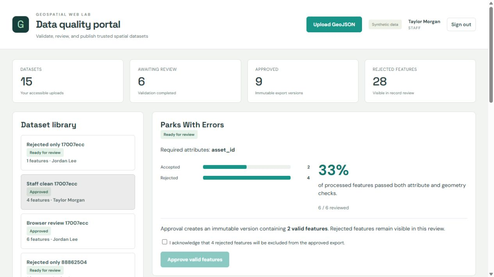

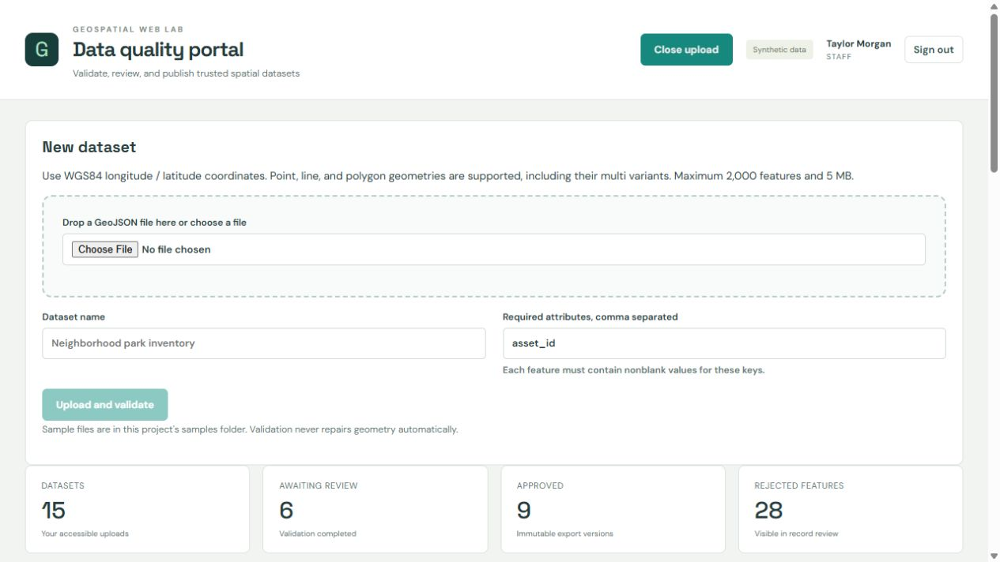

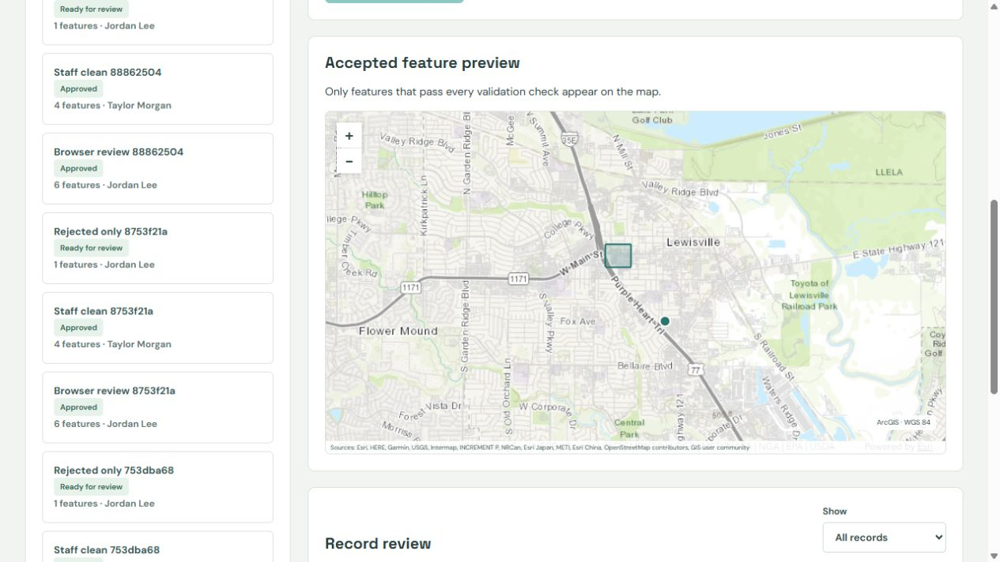

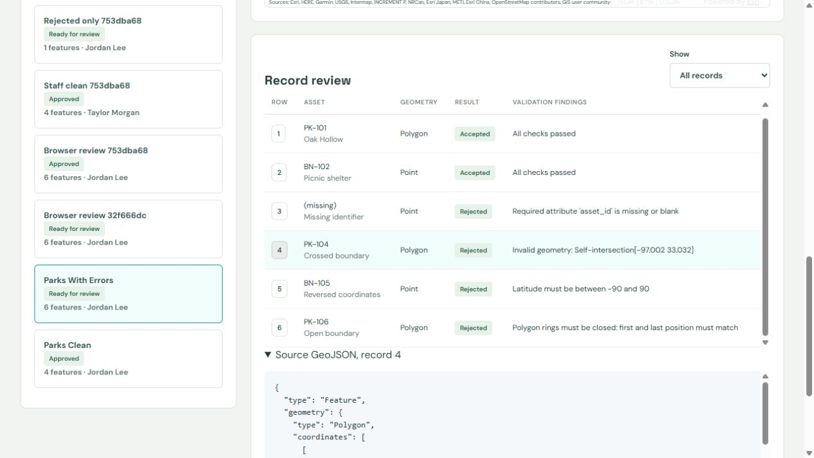

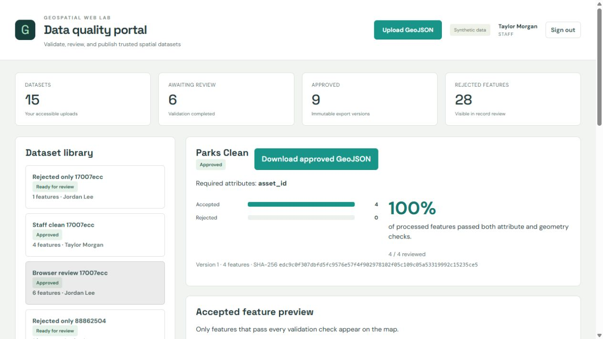

## 3. Fleet and geofence monitor

**Visual references: Figures 10-13 follow this chapter.**

The fleet monitor follows ten synthetic vehicles around looping routes in a fictional Dallas operations area. It demonstrates the full path from background processing and spatial queries to a live browser: a worker advances a route, Rails records each accepted position, PostGIS evaluates zone membership, and React refreshes the operational view. The **SIMULATION** label remains visible so that a moving marker cannot be mistaken for a real vehicle feed.

The application opens at port 5173. Staff can operate the simulation and maintain zones. The reporter account is an observer with access to the same fleet information, including routes, telemetry, and transitions. Permissions are enforced in Rails as well as reflected in disabled browser controls.

### Fleet summary and replay controls

Four summary cards explain the current persisted state. **Vehicles reporting** counts vehicles that have a position, rather than treating every seeded record as a fresh observation. **Inside a geofence** counts vehicles inside at least one monitored zone. A vehicle in overlapping zones contributes once to that fleet total. **Average speed** averages the latest speeds of vehicles with positions. **Replay frame** shows progress through the simulation, the selected multiplier, and the assumption of ten simulated seconds per frame.

**Start replay** begins asynchronous processing. **Pause** stops further advancement and leaves the latest positions, recorded trails, and history available for inspection. The running/paused indicator reports control state; a paused vehicle remains on the map. Route loops repeat automatically. There is no need to restart at the end of a route.

The **Replay speed** menu supports 1x, 2x, and 4x. These values determine the number of simulated frames processed by each worker job. Every intermediate point is evaluated, including its geofence transitions. The multiplier does not guarantee a particular wall-clock animation rate: scheduling, worker availability, and host load influence when jobs run. Simulated speed is calculated from PostGIS geography distance between consecutive route points and the ten-second frame interval, with a 250 km/h cap.

**Reset replay** is a destructive simulation control. It pauses replay and clears current positions, telemetry trails, zone memberships, and transition events. Vehicle identities, planned routes, geofence definitions, and the configured speed remain. Reset is useful for deliberately repeating an exercise; it is not required to resume a paused view.

### Linked vehicle list, map, and telemetry

Every vehicle row includes a color key, name, registration, zone membership summary, and latest speed. A vehicle without a recorded fix displays **Pending**. Selecting a row highlights its map marker and retrieves its history. Clicking a vehicle marker selects the corresponding record. Clicking a vehicle name in the transition table also changes the selection.

The map combines several distinct layers of meaning. Polygon outlines represent geofences. Vehicle markers show current accepted positions. A colored line shows the selected vehicle's recorded trail. The gray line shows its planned looping route. The **Planned route** checkbox hides or shows that reference line without deleting telemetry or changing replay. Standard map navigation changes the view only.

The selected vehicle's telemetry panel shows its latest observation time, longitude/latitude, last sequence number, and recorded trail count. Coordinates use longitude first. Observation timestamps are server-assigned processing times, not an advancing simulated clock. Sequence numbers establish ordering; they should not be interpreted as a GPS device clock.

The **Recent speed, km/h** chart displays the latest twelve retained points. Each bar is labelled with its sequence number. The trail holds at most 360 points per vehicle, so a long-running replay gradually replaces its oldest history. This is a bounded learning example, not an archival tracking service. The empty state explains that replay must run before a trail or speed history exists.

### Geofence creation and membership rules

The **Geofences** panel lists each named zone, its color, and the current number of vehicles inside it. Staff select **Add zone** to open a rectangular zone form; **Cancel** closes it. The form accepts a name of up to 80 characters and west, south, east, and north bounds. Longitude must be within -180 to 180 and latitude within -90 to 90. West must be smaller than east, and south smaller than north. **Create rectangular zone** constructs a closed polygon from those bounds.

The UI creates rectangles. The authenticated API also accepts arbitrary closed polygon rings with 4 to 200 coordinate pairs, including the repeated closing pair. Rings must contain finite longitude/latitude values, remain within coordinate bounds, avoid self-intersection, and enclose positive area. There is no browser polygon-drawing editor or existing-zone edit form.

PostGIS **ST_Covers** determines whether a position lies inside a zone. A point exactly on the polygon boundary counts as inside. A newly added zone is evaluated on the next accepted telemetry fix; adding a zone does not rewrite historical positions or immediately manufacture earlier transitions.

The **Remove** control deletes a zone, its memberships, and its associated events. The operation removes historical context as well as the visible polygon. It does not delete vehicle routes or telemetry points.

### Entry and exit chronology

**Zone event chronology** displays time, vehicle, transition, geofence, and sequence. An **entered** event records a change from outside to inside, including a vehicle's first accepted position when that position is inside. An **exited** event records a change from inside to outside. Consecutive positions that remain on the same side of a boundary do not create repeated events.

The default **All vehicles** filter shows the latest 100 transitions returned by the server. **Selected vehicle** filters that fetched window to the current vehicle. It does not retrieve the vehicle's complete historical record. The database retains at most 500 events globally, so older transitions can disappear as new events arrive. These two limits describe different boundaries: 500 retained records and 100 records available in the current screen's event window.

### Live updates, ingestion, and failure behavior

Action Cable sends update notifications to signed-in viewers. Each notification prompts the browser to reload committed fleet state; five-second polling provides a fallback. Reconnection also refreshes state. Responses from an older request or a previously selected vehicle are guarded against replacing newer display state.

The replay controller uses a database lock, a generation number, and an expected frame cursor. A repeated start does not create a second replay chain. Duplicate jobs cannot advance the same frame twice. Pausing or resetting invalidates jobs from the earlier generation. An enqueue failure rolls back the replay operation and surfaces a retryable error. If an executing worker process is lost unexpectedly, pausing and starting establishes a new generation. The application does not promise exactly-once delivery across PostgreSQL and Redis.

There is also a staff-only manual telemetry API for integration exercises. It accepts a nonnegative integer sequence, finite WGS84 longitude/latitude, and a speed from 0 to 250 km/h. Replay must be paused before manual ingestion. Duplicate or out-of-order sequences return an ignored result without changing the current vehicle or creating events. When replay resumes, its sequence advances beyond accepted manual input. Manual ingestion has no dedicated browser form.

The application does not provide route optimization, road-network matching, ETA prediction, a CSV export, device authentication, or a real GPS feed. Its demonstrated features are persisted simulation, ordered telemetry ingestion, linked spatial inspection, bounded history, and explicit geofence transitions. The implementation entry points are `frontend/src/App.jsx`, `ReplayEngine`, `TelemetryRecorder`, and the fleet, vehicle, and geofence API controllers under `03-fleet-monitor`.

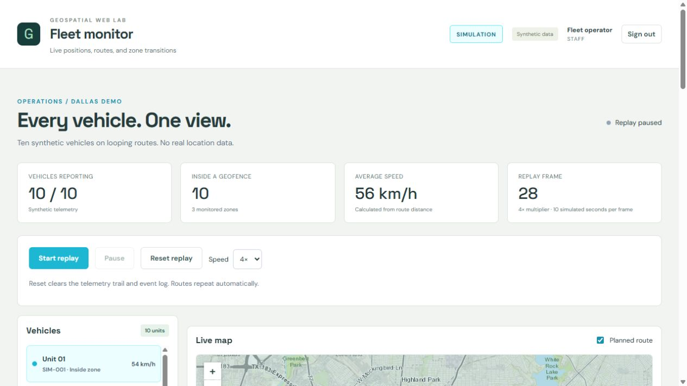


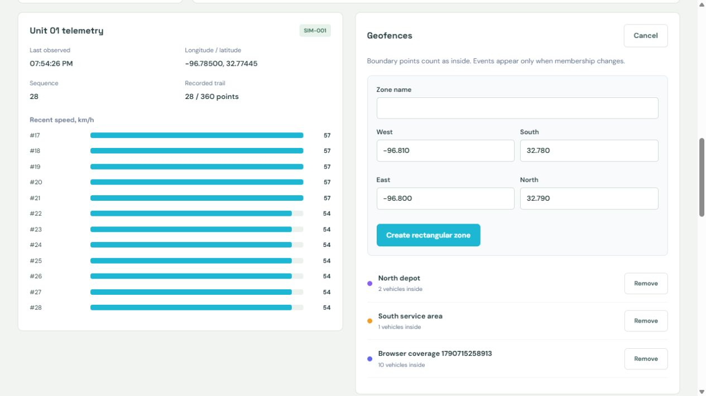

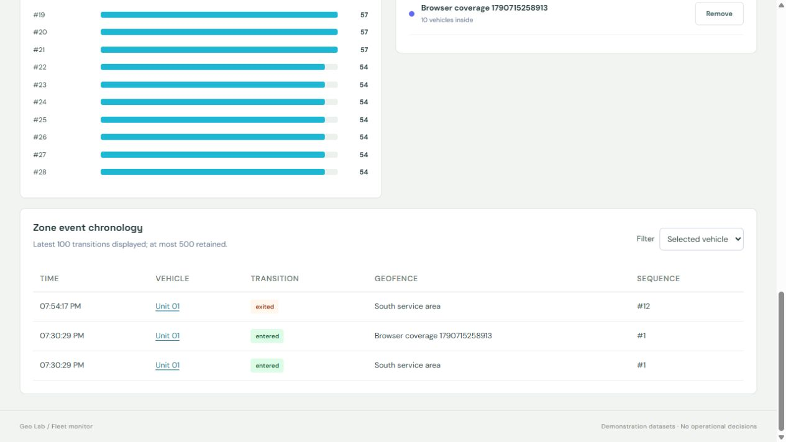

## 4. Parcel scenario explorer

**Visual references: Figures 14-15 follow this chapter.**

The parcel scenario explorer compares simple development-capacity assumptions over 24 synthetic parcels in two districts. It connects a map selection to server-side area calculations, saves each run as a named scenario, and presents comparison charts and downloadable calculation snapshots. Its purpose is to make the assumptions and arithmetic inspectable. The parcel boundaries, district names, and height limits are demonstration data.

The application opens at port 5174. Both staff and reporter accounts can create scenarios, but every account sees only its own saved records. Staff status does not grant access to another account's scenario list, exports, retries, or deletions. The parcel reference layer itself is shared among signed-in users.

### Summary cards and study-area selection

The top cards report **Available parcels**, **Selected land**, **Saved scenarios**, and **Ready to compare**. Selected land is shown in acres with a parcel count. Saved scenarios includes the account's records across processing states; ready-to-compare counts only completed calculations. The displayed selected acreage sums the rounded parcel acreage values used by the interface. The calculation worker uses unrounded geography areas, so a small difference between the summary and a saved result can arise from display rounding.

The **District** selector offers **All districts**, **River district**, and **North quarter**. It filters the parcel map and table together. The table identifies each parcel, district, acreage, and synthetic height limit in floors. A checkbox or a click on a map polygon toggles membership in the selection. Selected parcels are orange; the table also marks them as selected. Map navigation and parcel selection are separate operations.

**Select visible** replaces the selection with every parcel in the currently filtered table. The word visible refers to that district-filtered list, not to the current map viewport. Panning or zooming does not restrict the action. **Clear selection** removes all selected parcel IDs.

Changing the district by itself preserves an earlier selection, including parcels hidden by the new filter. This permits cross-district scenarios, but the selection count must be read before calculating. A fresh district study begins with Clear selection, followed by the district filter and the intended parcels. Saving a scenario also preserves the current selection, making it possible to reuse the same study area with different assumptions.

### Design assumptions and input limits

**Build a scenario** contains four inputs. **Scenario name** is required and limited to 100 characters. **Floors** accepts an integer from 1 through 30. **Unit area (sq ft)** accepts an integer from 400 through 3,000; the browser number control uses 25-square-foot steps. **Building coverage** is a slider from 5% to 80% in five-percentage-point steps. The server validates the coverage range independently.

The **Calculate ... selected parcels** button reflects the current selection count and is disabled when nothing is selected or a save is in progress. The server accepts 1 to 50 distinct existing parcel IDs. The seeded demonstration supplies 24. Unknown IDs, duplicate IDs, and invalid numeric assumptions are rejected instead of silently producing a partial calculation.

There is no editable scenario-results form. A change to floors, coverage, unit area, or selection produces a new named scenario when calculated. Existing completed results remain associated with their original inputs. This makes comparison deliberate and avoids overwriting the baseline while exploring another option.

### Calculation method and interpretation

PostGIS computes each selected polygon's geodesic area using its geography representation. The worker sums those areas and converts square metres to square feet before applying the assumptions. It does not treat longitude and latitude degrees as square feet.

The calculation is intentionally transparent:

| Result | Calculation or meaning |
| --- | --- |
| Site area | Sum of selected parcel geography areas |
| Gross floor area | Site area x coverage x floors |
| Residential floor area | Gross floor area x 0.80 |
| Estimated units | Residential floor area / typical unit area, rounded down |
| Open space | Site area x (1 - coverage) |
| Floor area ratio, FAR | Coverage x floors |

For example, with four floors and 40% coverage, FAR is 1.60. Increasing floors increases gross floor area and estimated unit capacity while leaving the model's open-space quantity unchanged. Increasing coverage increases gross floor area and reduces open space. Increasing typical unit area reduces estimated units without changing gross floor area. These relationships make it useful to compare one changed assumption at a time.

Open space means land outside the assumed building footprint. It does not establish usable landscaped space, public access, stormwater capacity, or compliance with a zoning definition. The fixed 80% residential efficiency is an exposed simplification. The model does not separately calculate circulation, parking, setbacks, construction costs, occupancy, or market demand.

If proposed floors exceed a selected parcel's synthetic height limit, the result contains a parcel-specific warning. The warning remains visible beside the saved scenario and is included in its exported results. It does not block calculation or constitute a permit decision.

### Background processing and saved results

Submitting a valid form saves an owned scenario and queues a Sidekiq calculation. The interface reports that it is queued and refreshes as results arrive. The lifecycle is **queued**, **processing**, **complete**, or **failed**. The processing state is written inside the same database transaction as the completed result. Normal API reads therefore observe queued followed by complete; the interface does not expose continuous calculation progress.

The saved-scenarios table displays name, state, floors/coverage, gross area, units, FAR, and available actions. Unfinished values are labelled **Pending**. Failure messages and height-limit warnings appear with their own scenario rather than as an unexplained missing chart. The source parcel geometry and measured area are captured when the worker performs the successful calculation.

Action Cable updates are private to the authenticated owner. The **Live** or **Reconnecting** badge reflects the notification connection, and a fifteen-second polling fallback retrieves persisted state. A lost notification does not invalidate a completed database result. Older requests are prevented from replacing newer state, and changing accounts discards the previous account's workspace selection and drafts.

### Side-by-side comparison

Comparison checkboxes are enabled only for complete scenarios. Selecting a row adds it to **Estimated unit capacity** and **Open space (sq ft)** bar charts. Up to four completed scenarios can be selected together. At that limit, further unchecked comparison boxes are disabled until one selection is removed. Unchecking a scenario changes the chart only; it does not delete the saved calculation.

The two charts explain different tradeoffs. A higher unit bar does not necessarily imply less open space, because changing floors can increase capacity without changing coverage. Scenario names label both charts, so distinct names such as “Courtyard 4 floors” and “Courtyard 6 floors” make the comparison legible.

### Export, retry, deletion, and reproducibility

**Export** downloads a completed scenario as JSON. The file includes the scenario's assumptions and results, a formula version, the 80% residential-efficiency assumption, warnings, and a snapshot of the selected parcel boundaries and measured areas. It is a reproducible calculation record, not a standalone GeoJSON layer or a generated planning drawing. The user ID is excluded from the exported scenario object, and access remains restricted to its owner.

**Retry** appears only for failed scenarios. The server also rejects retries for queued, processing, or complete records. A retry starts a new revision of the failed calculation; stale or repeated jobs cannot replace a newer result. If the queue is unavailable, the saved scenario becomes failed with an explanatory message and can be retried after service recovery. A selected parcel that disappears before calculation causes a failure rather than a partial result.

**Delete** removes the owner's saved scenario and removes it from the current comparison selection. It does not remove the shared parcel geometry. Completed calculations have no update endpoint; changing assumptions requires another record. This preservation is an application behavior, not a claim that direct database administrators cannot alter data.

For API-oriented learning, the parcel endpoint supports a district equality filter and a validated WGS84 bounding-box filter using PostGIS intersection. The browser currently loads the reference parcels and applies its district filter locally. The relevant implementation is in `04-parcel-scenarios/frontend/src/App.jsx`, `ScenarioCalculator`, `CalculateScenarioJob`, and the parcel/scenario controllers. Together these demonstrate spatial selection, explicit assumptions, private asynchronous results, comparison, and portable evidence of a calculation.

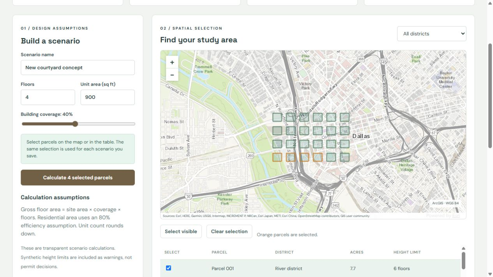


## 5. Infrastructure inspections: condition records in a 3D corridor

**Visual references: Figures 16-20 follow this chapter.**

The infrastructure application connects a small asset register, a CesiumJS scene, an observation history, and a background elevation-profile calculation. Its eight seeded poles, towers, and control cabinets represent a synthetic foothills corridor. The learning problem is to keep spatial context, measurements, field observations, staff decisions, and generated results consistent across a full application.

Open the interface at `http://127.0.0.1:5175`. Both staff and reporter accounts can explore assets, report observations, and generate or download profiles. Staff alone can resolve or reopen observations. Assets, observations, and profile runs form a shared workspace for signed-in users; profiles are not restricted to their creator.

### Corridor overview and asset register

Four summary cards report **Corridor assets**, **Open observations**, **Highest structure**, and **Ground elevation range**. Structure height means distance above the asset's base. Ground elevation is a separate synthetic input. These cards summarize the full register, even when its visible list is filtered.

The **Asset register** identifies each asset by code, name, and type. Its P, T, and C markers distinguish poles, towers, and cabinets. Each row shows its number of unresolved observations, and selecting a row links that record to the scene and detail panel. The **Show** control switches between **All assets** and **With open observations**. This narrows the register list only; it does not hide the remaining 3D models or change the summary totals.

Model colors communicate current condition. Blue-green indicates no open observations, amber indicates open observations, and red indicates at least one open critical observation. Selection adds visual emphasis. Counts and colors derive from persisted observation status, so resolving the last open observation changes the asset's displayed condition after refresh.


### Scene navigation, selection, and display controls

The **3D corridor** contains cylinders and cross-arms for poles and towers, boxes for cabinets, asset markers, labels, and a green surface strip between successive asset bases. Clicking a model or its marker selects the corresponding asset. The viewer's help text describes dragging to orbit or pan, using the wheel to zoom, and middle-dragging to tilt.

**View full corridor** restores the overview camera. **Focus in 3D**, in the selected-asset panel, moves the camera close to the current asset. These controls change the viewpoint without changing the selected record or stored data.

**Height display** offers actual scale, 3x visual exaggeration, and 5x visual exaggeration. Exaggeration expands elevation differences around the lowest corridor base and increases displayed structure dimensions, making the small synthetic objects easier to inspect. Labels continue to show the original structure height. The measurements, database values, and exported profile never acquire the display multiplier.

The **Labels** checkbox shows or hides code-and-height annotations. On narrow scene containers, only the selected asset's label remains visible to reduce overlap; labels also have a distance visibility limit. There is no separate layer-switching interface. The caption always identifies the synthetic surface, ellipsoid terrain, and current exaggeration.


### Height, base elevation, and top elevation

The selected-asset panel lists **Asset / type**, **Structure height**, **Base elevation**, and **Top elevation**. Its explanatory note connects the values directly: a structure starts at its base elevation and extends upward by its structure height.

`top_elevation_m = ground_elevation_m + structure_height_m`

The viewer uses `EllipsoidTerrainProvider` with explicitly supplied synthetic heights. It does not fetch a terrain DEM, satellite imagery, or a surveyed ground model. The green strip joins the synthetic base heights and provides visual context. It does not establish ground clearance, electrical clearance, slope safety, or construction suitability. Cesium workers and other runtime assets are served locally, and this corridor needs no ion token.

### Add an observation

**Add observation** opens a form for the selected asset. **Severity** offers low, medium, high, and critical. **Observation notes** require 10 to 2,000 characters. **Save observation** creates an open record; **Cancel** closes the form. The browser supplies the current observation timestamp, while Rails assigns the signed-in author rather than accepting an arbitrary author from the client.

Successful creation adds a `reported` history event. The card shows severity, open or resolved status, observation date, notes, and author. Changing the selected asset closes its creation form and clears its notes, avoiding accidental submission of the previous asset's draft to a different record. Validation and request failures appear as visible error notices instead of silently discarding the problem.

Observation time is validated on the server, including rejection of a timestamp more than five minutes in the future. The current UI does not provide an editable observation-date field, photographs, attachments, asset editing, or asset creation.

### Resolve, reopen, and inspect the audit history

Staff see **Resolve observation** on open records and **Reopen observation** on resolved records. The status form requires a meaningful resolution or reopening note of 10 to 2,000 characters. **Save status change** records the new state and a corresponding history event. A resolution also records the responsible staff member and resolution time; reopening clears the current resolution assignment while preserving the event chronology.

Expand **History** to read each reported, resolved, and reopened event with actor, time, and notes. The card displays the most recent resolution or reopening explanation separately. Original reporting notes remain available alongside later actions, so the reason for a decision is not reduced to a status badge.

Each update includes a `lock_version`. If another session changes the observation during an edit, the stale draft cannot silently overwrite the newer record. The interface disables that save and directs the user to cancel and reopen the form. Reporter accounts can read the history but cannot perform these staff transitions. No observation deletion or free-form editing of an existing report is exposed in the interface.


### Generate and review a corridor profile

**Generate profile** creates a source snapshot of the ordered asset register and queues processing through Sidekiq. At least two assets are required. The **Profile run** selector lists the ten newest runs, including run number, state, and creation time. A state notice explains `pending`, `processing`, `completed`, or `failed`. The generate button is disabled while the selected run is pending or processing, or another relevant request is busy.

For each adjacent asset pair, PostGIS geography functions measure geodesic distance and project ten sample positions at fractions 0.0 through 0.9 along that segment. The final corridor endpoint is appended once. Eight ordered assets therefore yield seven segments and **71 samples**. Horizontal sample positions follow the geodesic, including when a segment crosses the antimeridian. Elevation varies linearly between the two synthetic base elevations; no terrain interpolation from an external surface occurs.

`sample_count = 10 * (asset_count - 1) + 1`

`sample_elevation = first_base + fraction * (second_base - first_base)`

The chart plots base elevation against accumulated corridor distance. The completed panel also reports corridor length and highest asset top. **Profile samples** expands a scrollable table of distance and synthetic elevation. These are calculations from the recorded input snapshot, not new observations of the ground.


### Export, retry, and live recovery

**Download profile GeoJSON** is available only after completion. Its FeatureCollection contains a Point for every sample, with longitude, latitude, and synthetic elevation coordinates, plus station distance and elevation properties. Metadata contains the summary, the source asset snapshot, and an explicit synthetic-data statement. Later source changes do not alter an existing run's inputs or result.

A failed run exposes **Retry preprocessing**. Retrying retains its source snapshot and increments its processing generation. Job checks and database locks prevent stale or duplicate workers from overwriting a completed result. An enqueue failure becomes a visible failed run instead of remaining indefinitely pending.

Action Cable notifications trigger authoritative data refreshes, and a six-second polling fallback recovers persisted changes when a notification is missed. Successful observations or calculations remain saved if broadcast delivery fails. Reconnecting also refreshes the workspace. If WebGL initialization fails, the scene reports the problem while the asset register and observation forms remain available.

The demonstrated scope is asset-context exploration, condition reporting, documented status transitions, and reproducible synthetic profile generation. It contains no measured-terrain integration, inspection routing, offline field collection, work-order dispatch, equipment network analysis, or engineering clearance certification.

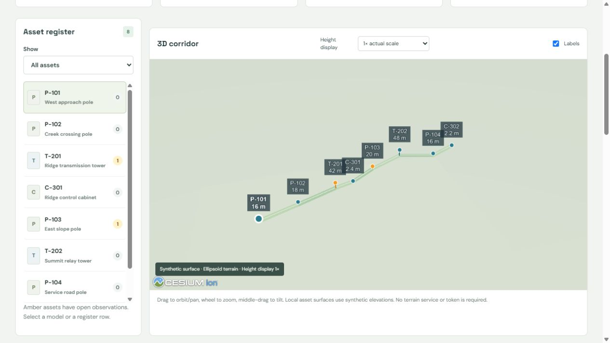

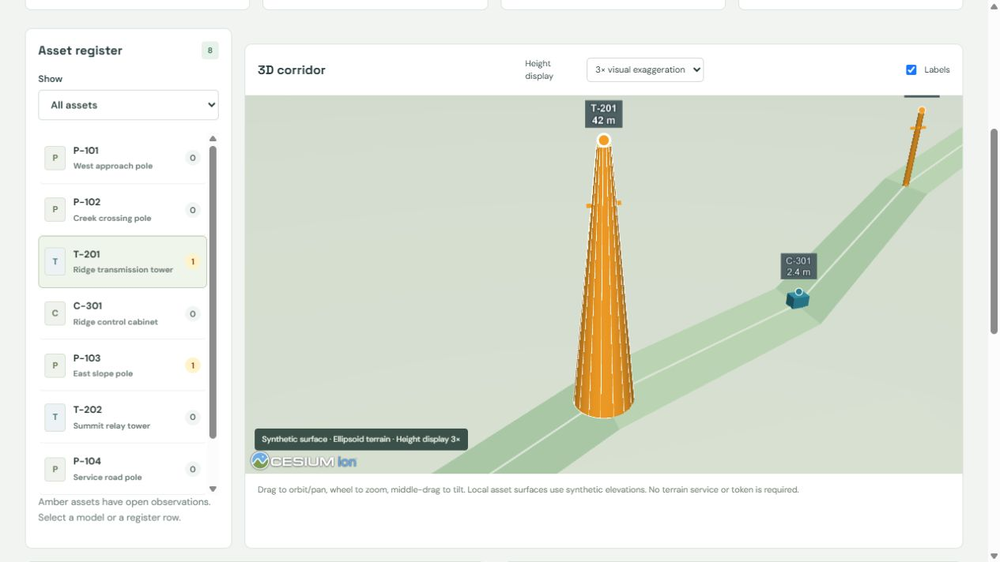

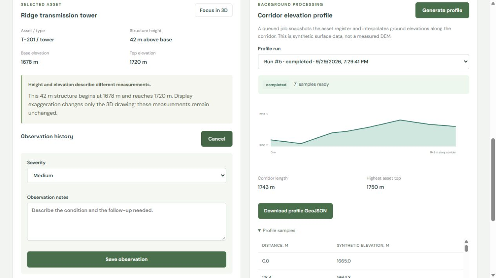

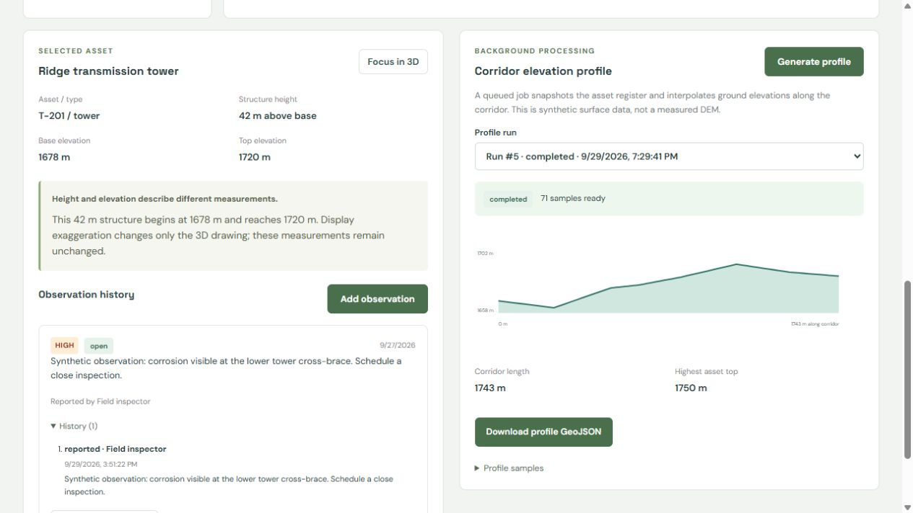

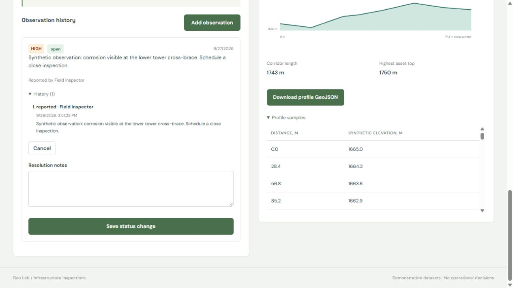

## 6. Shared architecture, permissions, and evidence

**Visual reference: Figure 21 follows this chapter.**

The five applications implement the same architectural pattern with separate domain models and databases. React renders the interface and calls Rails JSON APIs. PostgreSQL persists records, and PostGIS supplies spatial operations. Redis supports Action Cable delivery and Sidekiq jobs. ArcGIS Maps SDK provides the 2D mapping interfaces; CesiumJS supplies the infrastructure scene. Shared components standardize authentication, requests, charts, maps, and layout without turning the five databases into one shared business system.

### What happens after a user action

A save or approval sends an API request to Rails, which authenticates the session, validates input, checks role or ownership, and commits the record. The initiating browser receives its result. Other connected sessions receive a notification and fetch authoritative data.

Longer operations use a persisted job record and a separate worker. Imports, CSV exports, dataset validation, telemetry replay, scenario calculation, and profile generation expose progress or lifecycle state rather than relying on an open browser tab to finish computation. App-specific deduplication, versions, generations, and locks address repeated work and concurrency. They are different domain safeguards, not a blanket guarantee that every operation has identical retry semantics.

Polling and reconnect refreshes supplement WebSockets. A temporary delivery failure does not erase committed records or completed calculations. The browser is a view of persisted server data; browser storage is not the substitute database.

### Authentication and account boundaries

Each app has an independent session cookie. Same-app tabs share a login; different apps do not. Seeded staff and reporter accounts support demonstrations. Service requests includes a second staff account for concurrent edits.

Sessions expire after 24 hours. Server-side session records use hashed tokens and permit revocation. Logging out invalidates that login, including a copied cookie, and disconnects its live subscriptions. A periodic authorization check provides a fallback when immediate disconnect delivery fails. Other independently established logins are separate sessions.

Mutations require Rails CSRF protection. The shared client refreshes a rotated CSRF token and retries only a request explicitly rejected for invalid CSRF. Session sequencing guards prevent older login or session responses from replacing a newer account state. Login and logout changes propagate across same-app tabs, clearing the previous account's workspace drafts. Refocusing a tab with the same account preserves the current draft while revalidating its session.

| Application | Reporter access | Additional staff access |
| --- | --- | --- |
| Service requests | Create and view own requests | View operational register; assign and change status; import and request exports |
| Data quality portal | Upload and review owned datasets; download owned approved output | Review all datasets and approve valid features |
| Fleet monitor | Observe vehicles, routes, zones, and events | Control replay and modify zones |
| Parcel scenarios | Create, compare, export, retry, and delete own scenarios | Same ownership boundary; no access to another user's scenarios |
| Infrastructure inspections | View shared assets and history; add observations; generate, retry, and download shared profiles | Resolve and reopen observations |

Backend routes and queries enforce these boundaries. Demo credentials must be replaced before external deployment.

### Spatial computation and data integrity

Spatial operations include service-request radius filters, uploaded-feature validation, geofence membership, parcel areas, and geodesic corridor stationing. Native spatial columns, indexes, and database constraints support these operations.

The report distinguishes map presentation from analytical authority. A basemap provides context, whereas Rails and PostGIS enforce accepted coordinates and compute outcomes. Fleet speed and position are simulated inputs. Parcel estimates use declared assumptions. Corridor elevations are synthetic source values. A rendered map does not make those datasets measured, verified against field conditions, or fit for regulatory decisions.

Concurrency controls address specific failure modes: stale request assignments and observation transitions reject outdated versions; approved dataset snapshots preserve reviewed bytes; jobs use domain-appropriate guards against duplicate execution or obsolete revisions. Application-specific chapters explain the resulting user-visible behavior.

### Verification baseline

The documented application baseline is commit `72205d5c0ad9fdcdf90c929e0b506c3280f7bf5f`. The September 29 local verification record reports the following completed checks. These are application checks recorded before this illustrated report, rather than tests created by taking screenshots.

| Evidence | Recorded result | What it supports |
| --- | --- | --- |
| Rails backend suites | 109 tests, 690 assertions; no failures, errors, or skips | Domain validation, spatial operations, permissions, job behavior, concurrency, and session regressions |
| React tests | 44 tests across 10 suites passed | Focused request, session, component, stale-result, and geometry behavior |
| Browser scenarios | 13 passed against real APIs, databases, Redis, and workers | Integrated user workflows, persisted changes, exports, live delivery, and selected responsive behavior |
| Production frontend builds | All five passed | Build and asset packaging compatibility |
| Compose configuration | All five parsed | Configuration validity, without proving that the images run |

The repository's [successful GitHub Actions baseline run](https://github.com/efkopru/geospatial-web-lab/actions/runs/36653889317) separately exercised the applications at this revision using Ruby 3.4 and PostgreSQL 17/PostGIS 3.5. The local audit used Ruby 3.2.3 and PostgreSQL 16/PostGIS 3.4 in Ubuntu 24.04 WSL. Dependency lockfiles and the workflow record the exact package choices.

Additional recorded checks cover production eager loading and database queries, restricted-role migrations, runtime supervisor cleanup, punctuation-containing database passwords, rejected hosts and missing CSRF tokens, and a service-request database backup restored into a temporary database. That recovery check covers service requests, not a separate restore exercise for all five applications. Browser tests intentionally leave synthetic test records in development databases, so later screenshots may show more records than the initial seeds.

### Deployment preparation and its limits

Each Compose stack defines nginx, Rails, a separate worker, PostGIS, and Redis, with persistent volumes and ordered initialization. Environment configuration generates missing secrets while preserving existing values. Migrations run during startup, while demo seeding remains explicit. The application database role is separate from the PostgreSQL administrator and does not own the PostGIS extension.

The Docker engine was unavailable during local verification. Container image builds and container runtime execution remain unverified even though configuration parsing passed. The applications were executed directly in WSL, and CI provides a separate working test environment. No public hosting has been created.

External deployment still requires host and origin settings, HTTPS, secure cookies, trusted proxy configuration, replacement demo accounts, secret management, and operational verification. Dockerfiles and build success cannot establish uptime, capacity, or production readiness.

### Portfolio interpretation

Describe the repository as an **AI-assisted learning and portfolio project using synthetic operational data**. Its evidence supports implementation of five integrated geospatial workflows and the recorded tests. It does not support claims of municipal deployment, production fleet tracking, field survey accuracy, business savings, user adoption, load-tested scale, or independent security certification.

Screenshots document the running interface and the state visible at capture time. They complement source review and tests; they do not independently verify every backend branch. ArcGIS basemaps and SDK assets require network access, while full map and scene rendering requires suitable browser graphics support. The Cesium corridor's runtime assets are local and its elevations are synthetic.

Reproduction commands are in [HOW_TO_USE.md](HOW_TO_USE.md); dated checks and corrections are in [VERIFICATION.md](VERIFICATION.md), [AUDIT.md](AUDIT.md), and [AUDIT_SECOND_PASS.md](AUDIT_SECOND_PASS.md). Exclude credentials, backups, and private runtime logs from releases. A private repository provides neither public application hosting nor a redistribution license.

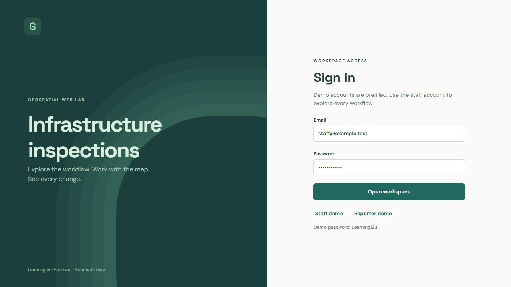

## 7. Reproduction and screenshot provenance

### Open the applications

The complete dependency, setup, seed, start, stop, account, and workflow instructions are in [HOW_TO_USE.md](HOW_TO_USE.md). The concise project overview is [README.md](README.md); portfolio positioning is [PROJECT_SUMMARY.md](PROJECT_SUMMARY.md). Run the five frontends together with the corresponding Rails APIs and Sidekiq workers. Browser-only startup does not supply persisted data or background results.

| Application | Local browser address | Rails API port |
| --- | --- | --- |
| Service requests | [Open Civic Works](http://127.0.0.1:5171/) | 3101 |
| Data quality portal | [Open data quality](http://127.0.0.1:5172/) | 3102 |
| Fleet monitor | [Open fleet monitor](http://127.0.0.1:5173/) | 3103 |
| Parcel scenarios | [Open parcel scenarios](http://127.0.0.1:5174/) | 3104 |
| Infrastructure inspections | [Open infrastructure inspections](http://127.0.0.1:5175/) | 3105 |

After dependencies and databases have already been prepared, the two launch commands from the repository root are:

```bash
bash scripts/start-backends.sh
```

```powershell
node scripts/dev-frontends.mjs
```

Keep each launcher running in its own terminal. Startup applies migrations but does not reset the demonstration data or run seeds. Use the same loopback hostname consistently. These local links work only when the applications are running on the reader's computer.

The seeded accounts are `staff@example.test` and `reporter@example.test`, both using the documented learning password `Learning123!`. Civic Works additionally includes `crew@example.test` as a second staff account. Use distinct browser profiles or private sessions to demonstrate simultaneous independent users; ordinary tabs share an app's cookie.

### Capture method and what the images establish

The chapters describe implemented user-facing controls and the API-only capabilities that affect their workflows. Screenshots illustrate representative states. Authentication, failure paths, authorization, and concurrency also rely on implementation review and recorded tests; their inclusion here does not imply that every branch was re-exercised during this documentation session.

All 21 figures were captured on September 29, 2026, America/Chicago, from the running local applications. Twenty figures use a 1265 x 712 browser viewport; the sign-in capture in Figure 21 uses 1280 x 720. Figure 13 retains the chronology's filter, heading, columns, and complete displayed rows. The image files preserve the captured pixels and their proportions in the PDF.

The sequence involved sign-in, read-only selection and filtering, map zoom, scene focus, disclosure expansion, and opening forms. It did not submit new records, approve datasets, resolve observations, delete data, or reset replay. The fleet remained paused at frame 28. Existing browser-test records remain visible, including timestamped names and a coverage geofence. These are synthetic test artifacts, not customer records or current live fleet data.

ArcGIS basemaps were visibly loaded before capture. The Cesium figures show the rendered local 3D corridor. No screenshot was synthesized to replace a failed view. Form captures are explicitly labelled as pre-submission states. The profile, dataset approvals, import/export jobs, and parcel results shown were existing completed records; this screenshot session did not rerun those jobs.

Source review provided feature coverage, while the verification chapter separates earlier automated application checks from the present documentation work. Screenshot totals and operational counters may change after another test run. Record counts are not benchmark results.

### Rebuild the illustrated PDF

The Markdown source and screenshot files are the maintainable inputs. The dedicated [report builder](scripts/build-feature-report.py) uses ReportLab and the font helpers in [the core documentation builder](scripts/build-docs.py). Segoe UI is used on Windows, with DejaVu Sans as a Linux fallback.

```bash
python scripts/build-feature-report.py
```

The default output is `output/pdf/FEATURE_REPORT.pdf`. Local links in the PDF are relative to that location; preserve the repository layout when sharing the whole documentation package. Images are embedded in the PDF, so reading its screenshots does not require the JPEG files or an internet connection. Linked source documents and the private CI run require their corresponding files or account access.

### Implementation references

| Area | Source entry point |
| --- | --- |
| Civic Works interface | [Service request application](01-service-requests/frontend/src/App.jsx) |
| Data quality interface | [Dataset review application](02-data-quality-portal/frontend/src/App.jsx) |
| Fleet interface | [Fleet application](03-fleet-monitor/frontend/src/App.jsx) |
| Parcel interface | [Scenario application](04-parcel-scenarios/frontend/src/App.jsx) |
| Infrastructure interface | [Inspection application](05-infrastructure-inspections/frontend/src/App.jsx) |

The accompanying backend folders contain each application's models, API controllers, services, jobs, migrations, and tests. [The verification record](VERIFICATION.md) identifies the evidence supporting the release, and the two audit documents record corrected defects. The report's source baseline identifies the application code being described; a subsequent documentation commit changes this report and its figures without implying a new application feature.
