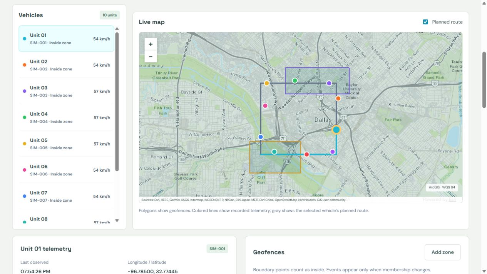

# Geospatial Web Lab: portfolio content and implementation brief

Prepared September 29, 2026; facts and evidence refreshed October 1, 2026. This document covers **five applications with two editions each**: the original full-stack implementations and separate standalone browser implementations.

Use sections 1 and 2 as public portfolio content. Sections 3 through 6 are implementation notes and evidence references for the portfolio maintainer. This is a content handoff; it does not change or publish the portfolio website.

## 1. Project card and page metadata

| Field | Content |
| --- | --- |
| Project title | Geospatial Web Lab |
| Subtitle | Five geospatial workflows, two application architectures |
| Category | Geospatial Software Engineering |
| Secondary category | Full-Stack Web Development |
| Project type | AI-assisted personal learning and portfolio project |
| Data | Synthetic application records and geometry |
| Date | September 2026 |
| Proposed page route | `/projects/geospatial-web-lab/` |
| Primary button | Read case study |
| Primary button destination | The project's implemented portfolio page |
| Public demo URL | `https://efkopru.github.io/geospatial-web-lab/`: the standalone browser editions, published by the `Publish standalone demo` workflow and checked after each deployment. Secondary button: "Open live demo" |
| Public source URL | `https://github.com/efkopru/geospatial-web-lab` (public since October 1, 2026). Optional "View source" button |
| Card/hero image source | `output/screenshots/feature-report/03-live-map.jpg` |
| Card/hero image alt text | Full-stack fleet monitor showing synthetic vehicle routes and geofences around Dallas. |
| Technology badges | Ruby on Rails, React, PostgreSQL/PostGIS, ArcGIS, CesiumJS, Sidekiq, IndexedDB, JSTS |

### Short card description

Five geospatial applications covering service requests, data validation, simulated fleets, parcel scenarios, and 3D inspections. Built as an AI-assisted project, the suite compares Rails and PostGIS backends with standalone browser editions that retain interactive workflows and local persistence.

### Search metadata

**Page title:** Geospatial Web Lab | Full-Stack GIS Applications

**Description:** Five geospatial apps built with Rails, React, PostGIS, ArcGIS and Cesium, with standalone browser editions, tested workflows and synthetic data.

## 2. Copy-ready case study

### Geospatial Web Lab

**Five geospatial workflows, two application architectures.**

Geospatial Web Lab connects spatial data with the web workflows around it: reporting an issue, reviewing an import, tracking a simulated vehicle, comparing a planning scenario, and documenting an infrastructure observation.

The project contains five full-stack applications built with Ruby on Rails, React, PostgreSQL/PostGIS, ArcGIS Maps SDK, and CesiumJS. Each also has a separate standalone browser edition. The two editions make it possible to compare the same workflow using server-managed records and background jobs or browser-managed state and local calculations.

This is an AI-assisted personal learning and portfolio project. Application records, routes, parcels, assets, and elevations are synthetic. External basemaps provide geographic context.



*Full-stack edition. The fleet is simulated; the screenshot does not represent an operational GPS feed.*

### The engineering problem

A useful geospatial application needs more than a map. It needs clear record ownership, validated inputs, understandable processing states, reproducible outputs, and reliable behavior when users edit concurrently or connections fail.

The project explores those responsibilities through complete workflows. The full-stack applications put permissions, spatial operations, and durable jobs on the server. The standalone editions retain the interfaces and useful interactions while making local storage, simulated roles, and browser processing explicit.

### Five implemented applications

#### Civic Works: mapped service requests

Users create geolocated requests and review them through linked maps and registers. Text, category, status, and distance filters narrow the workspace. Staff assign requests and move them through permitted lifecycle states. Stale-edit checks prevent an older draft from silently replacing a newer update.

GeoJSON imports retain valid rows, report rejected records, and identify duplicate submissions. CSV exports preserve a downloadable snapshot. The full-stack edition processes imports and exports with background workers; the standalone edition completes them locally and stores results in IndexedDB.


*Standalone edition. Request creation, assignment, reload persistence, and CSV download were checked in the browser.*

#### Data Quality Portal: review before approval

The portal accepts GeoJSON and validates required attributes, coordinate structure, supported geometry types, and topology. Reviewers can inspect accepted and rejected records, examine individual findings, and preview accepted features on the map.

Approval excludes invalid records only after an explicit acknowledgment. Approval stores a versioned export snapshot and a SHA-256 digest calculated from its exact bytes. The full-stack edition uses PostGIS and database-enforced immutable versions. The standalone edition uses JSTS and stored export snapshots; its browser storage is user-editable.


*Standalone edition. The illustrated six-feature source contains two accepted and four rejected records.*

#### Fleet Monitor: telemetry and geofence transitions

Ten synthetic vehicles follow replayable routes. Playback controls change speed, pause activity, or reset telemetry. Linked vehicle selection, route overlays, retained trails, speed charts, and geofence events make movement inspectable.

Staff can manage zones, and boundary points count as inside a geofence. Sequence checks reject older telemetry. The full-stack edition combines worker processing, PostGIS, and authenticated updates. The standalone edition uses a coordinated browser timer so multiple tabs do not run competing replay loops.


*Standalone edition. Frame counts, speeds, and events are simulation state, not measurements from deployed vehicles.*

#### Parcel Scenario Explorer: transparent capacity calculations

Users select from 24 synthetic parcels, set floors, coverage, and unit-area assumptions, then compare up to four saved scenarios. Results include gross floor area, estimated unit capacity, open space, and floor-area ratio. Synthetic height limits appear as planning warnings.

Exports retain assumptions, results, and parcel geometry snapshots. The full-stack edition calculates results asynchronously using PostGIS geography areas. The standalone edition calculates spherical rectangle areas locally. Numerical differences between the editions are documented rather than hidden.


*Standalone edition. The estimates demonstrate explicit formulas; they are not zoning determinations or permit calculations.*

#### Infrastructure Inspections: assets in three dimensions

A CesiumJS corridor displays eight synthetic assets with linked scene and register selection. Base elevation, structure height, and top elevation remain separate measurements. Display exaggeration changes the drawing without changing recorded values.

Users record observations; staff resolve or reopen them with notes and history. Stale-edit checks protect accepted updates. Profile generation produces 71 samples, a chart, a sample table, and a GeoJSON export with source metadata. The profile interpolates synthetic elevations rather than sampling surveyed terrain.


*Standalone edition. The selected tower is drawn at 3x visual exaggeration while its recorded structure height remains 42 metres.*

### Two architectures, distinct responsibilities

| Responsibility | Full-stack edition | Standalone browser edition |
| --- | --- | --- |
| Application data | Separate PostgreSQL/PostGIS database per app | Separate IndexedDB database per app and browser origin |
| Identity and permissions | Authenticated Rails APIs with ownership and staff checks | Locally selected demo identities with simulated workflow rules |
| Processing | Redis and Sidekiq workers | JavaScript actions and a coordinated fleet timer |
| Updates | Authenticated Action Cable notifications, refresh, and polling | Local subscriptions and compatible cross-tab notifications |
| Spatial operations | PostGIS validation, distance, area, and geodesic processing | JSTS validity checks and documented JavaScript spatial formulas |
| Delivery | Frontend assets plus hosted backend services | Static files served over HTTP or HTTPS |

Standalone records do not synchronize with the full-stack databases. Browser processing stops when the page closes. ArcGIS basemaps and SDK resources require internet access; the suite is not presented as fully offline software.

### Engineering decisions

**Separate committed results from notification delivery.** In the full-stack applications, a notification failure does not undo a successful write or completed calculation. Clients can recover authoritative state through refresh and polling.

**Treat concurrent work as a normal condition.** Record versions reject stale edits. Job revisions guard against obsolete results. Standalone storage transactions and revision checks prevent one tab from silently overwriting a newer accepted state.

**Preserve the inputs behind an output.** Approved data exports, parcel calculations, and completed profiles retain the information needed to explain their results. The quality portal stores a SHA-256 digest alongside each approved snapshot, allowing the downloaded bytes to be checked against that digest.

**Make the cost of a change follow the size of the change.** The standalone editions store each record as its own browser-database entry and save only what a change touched. A change that took about 2 seconds with 30 MB stored now takes a few milliseconds. In the full-stack editions, a benchmark found a dataset list loading megabytes of stored GeoJSON per row; it now reads only the columns it shows and serves about 20 times more requests per second.

**Keep the original implementations available.** The standalone conversion added separate folders and its own dependencies. All 371 previously tracked files were unchanged at conversion, preserving the full-stack suite for comparison.

### Verification and outcome

The verification records report:

| Edition | Recorded checks |
| --- | --- |
| Full-stack | Rails, frontend and browser suites: 145 Rails tests with 972 assertions and 50 frontend tests, recorded locally on October 5, 2026, and 13 browser scenarios against running services. CI runs them again on pull requests and on `main`, skipping changes limited to the standalone editions, Markdown files or `output/`. All five Docker stacks build and pass a container smoke test in CI. Benchmarks cover API latency, concurrent reads and background-job duration |
| Standalone | 70 domain, storage and packaging tests; 10 interface tests; five static builds; a static-site check; browser checks of persistence, calculations, simulation, approvals, downloads, backup restore and storage migration |

Both editions' test and build pipelines run in clean Ubuntu CI checkouts. ESLint (both editions) and Brakeman (the five Rails backends) run in CI on every pull request and on `main`. These checks establish specific implemented behaviors. The benchmarks are single-machine measurements on synthetic data. They are not capacity guarantees, security certification, or evidence of operational adoption.

The resulting suite demonstrates full-stack GIS integration alongside a portable browser implementation of the same problem set. It provides concrete examples of spatial validation, asynchronous processing, interactive mapping, reproducible exports, and explicit architectural tradeoffs.

### Scope

The standalone browser editions are published as a static demo at https://efkopru.github.io/geospatial-web-lab/; the full-stack applications have no public deployment. It uses synthetic data and makes no claim of municipal use, customer adoption, business savings, field-survey accuracy, or production scale. Docker images for all five full-stack applications build and pass a container smoke test in CI; this is not a hosted deployment. The standalone editions are browser applications, not desktop installers.

---

## 3. Portfolio implementation instructions

These notes are for the person or agent updating the portfolio. Do not render them as public case-study content.

1. Read the destination portfolio's current project schema and conventions. Add one project named **Geospatial Web Lab**, with five applications and two editions. Preserve the site's existing typography, navigation, and project grouping.
2. Use the card text and metadata from section 1. Map the proposed route to the site's routing conventions. Set `sourceUrl` to the public repository if the page should offer a "View source" button. Set `demoUrl` to the published standalone demo and label it as the standalone browser edition. Do not render empty links, `#` placeholders, localhost links, or inaccessible private-repository buttons.
3. Use section 2 for the project page. Keep the AI-assisted description, synthetic-data labels, edition captions, and scope paragraph. If the page must be shorter, retain the overview, five-app summary, architecture comparison, and verification evidence.
4. Copy the selected images using section 4. Rewrite relative Markdown image paths to the portfolio's actual asset URLs. Existing repository-relative paths work here but will not automatically work in a different repository.
5. Make the first image the main visual. Present the five standalone screenshots as a gallery with edition labels and readable expanded views. Full-page screenshots need `height: auto` and a contain-style presentation; avoid cropping away attribution or important controls. Use descriptive alt text, intrinsic dimensions, and lazy loading for images below the main visual.
6. Implement the architecture comparison as a semantic table or an accessible responsive equivalent. Present tests by edition. Do not add assertions, manual checks, screenshots, and automated tests into a single total.
7. The standalone demo is published at https://efkopru.github.io/geospatial-web-lab/. The `Publish standalone demo` workflow deploys `standalone/dist` to GitHub Pages, checks every app path, asset and notice, then opens each app in Chromium. There it exports a backup, restores a changed backup and confirms the change survives a reload. Rerun that workflow after standalone changes. Label the demo as the standalone browser edition with synthetic data. The full-stack edition still requires backend services and has no public deployment.
8. Run the destination portfolio's normal validation and inspect desktop and mobile rendering. Verify the resulting project route, image loading, captions, and link destinations. Website deployment remains a separate action from creating this Markdown document.

### Framework-neutral content model

Adapt these fields to the existing portfolio schema. This is example content, not a drop-in configuration for an inspected website.

```json
{
  "slug": "geospatial-web-lab",
  "title": "Geospatial Web Lab",
  "subtitle": "Five geospatial workflows, two application architectures",
  "category": "Geospatial Software Engineering",
  "projectType": "AI-assisted personal learning and portfolio project",
  "date": "2026-09",
  "dataType": "Synthetic application data",
  "editions": ["Full-stack", "Standalone browser"],
  "heroImage": "/images/projects/geospatial-web-lab/fleet-full-stack.jpg",
  "heroAlt": "Full-stack fleet monitor showing synthetic vehicle routes and geofences around Dallas.",
  "demoUrl": "https://efkopru.github.io/geospatial-web-lab/",
  "sourceUrl": "https://github.com/efkopru/geospatial-web-lab"
}
```

## 4. Screenshot and asset map

Source paths are relative to this repository. Destination filenames below use the example portfolio directory `public/images/projects/geospatial-web-lab/`; adapt the directory to the destination site's asset convention. These are existing application screenshots, not images that need generation.

| Source image | Destination filename | Edition and use |
| --- | --- | --- |
| [Fleet map](output/screenshots/feature-report/03-live-map.jpg) | `fleet-full-stack.jpg` | Full-stack; card and main project image |
| [Civic Works](standalone/screenshots/01-service-requests.jpg) | `service-requests-standalone.jpg` | Standalone; requests, assignment, map, and register |
| [Data Quality Portal](standalone/screenshots/02-data-quality-portal.jpg) | `data-quality-standalone.jpg` | Standalone; validation findings and approved export |
| [Fleet Monitor](standalone/screenshots/03-fleet-monitor.jpg) | `fleet-standalone.jpg` | Standalone; replay, telemetry, and geofence events |
| [Parcel Scenario Explorer](standalone/screenshots/04-parcel-scenarios.jpg) | `parcels-standalone.jpg` | Standalone; assumptions, selection, and comparison |
| [Infrastructure Inspections](standalone/screenshots/05-infrastructure-inspections.jpg) | `inspections-standalone.jpg` | Standalone; Cesium scene and calculated profile |
| [Comparison gallery](standalone/screenshots/00-comparison-gallery.jpg) | `comparison-gallery.jpg` | Optional supplementary image of the local edition launcher |
| [Focused tower](output/screenshots/feature-report/05-focused-tower.jpg) | `tower-full-stack.jpg` | Optional supplementary full-stack 3D detail |

Keep map attribution visible. Identify the edition beside every image. Counts and timestamps are capture-time state and can differ from fresh seed data. Third-party reference-site captures in `output/screenshots/public-references/` are not this project's applications and are excluded from the portfolio asset map.

## 5. Claims and link controls

| Use | Do not substitute |
| --- | --- |
| Five applications with full-stack and standalone editions | Ten unrelated products |
| AI-assisted personal learning and portfolio project | A client engagement or independently authored production system |
| Simulated fleet replay | Operational GPS tracking or real-time transit integration |
| Database-enforced immutable full-stack dataset versions | Tamper-proof standalone browser records |
| Standalone role simulation | Authentication or protected multi-user access |
| Documented spherical approximations | Exact parity with PostGIS ellipsoidal calculations |
| Synthetic parcel capacity and elevation examples | Permitting advice, measured terrain, or engineering clearance analysis |
| Local JSON backup export and same-app restore | Cloud synchronization, cross-device sync, or record merging |
| Published standalone browser demo with automated site and browser checks | A hosted full-stack deployment, server-side persistence, or a fully offline app |
| Container builds and smoke tests in CI | A hosted or production deployment |
| Recorded single-runner benchmarks | Proven capacity, uptime, or production scale |
| Recorded tests and browser checks | Proven uptime, production scale, security certification, or business impact |

The source repository was private while this document was first prepared and was made public on October 1, 2026. A source link and CI links can now appear on the public page. The repository has no license file, so public source is viewable but grants no reuse license. Do not publish local account credentials, machine paths, database backups, or runtime logs.

## 6. Maintainer evidence references

Original application source baseline: `4d231e37b75754b206398ffcee371c1479913b9e`. The October 1 refresh covers the work merged afterwards: backup restore, storage limits, record-level standalone storage, container CI and benchmarks. Its standalone test counts were rerun locally; full-stack counts come from the dated records and CI. The October 6 update takes the full-stack counts from the merged-state record of October 5 in [VERIFICATION.md](VERIFICATION.md#merged-state-october-5-2026); all 13 browser scenarios passed in the [full-stack CI run on `main` at 146f111](https://github.com/efkopru/geospatial-web-lab/actions/runs/37396612166). Repository visibility and the successful standalone CI run were checked while preparing this document.

| Reference | What it supports |
| --- | --- |
| [Full-stack project summary](PROJECT_SUMMARY.md) | Purpose, architecture, implementation evidence, and AI-assisted framing |
| [Full-stack verification](VERIFICATION.md) | Recorded backend, frontend, browser, build, recovery and container checks, and full-stack benchmarks |
| [Illustrated feature report](FEATURE_REPORT.md) | Detailed full-stack features and screenshot provenance |
| [Standalone setup](standalone/README.md) | Requirements, local use, storage behavior, builds, and preview commands |
| [Edition comparison](standalone/COMPARISON.md) | Feature differences, local-processing limits, and spatial assumptions |
| [Standalone verification](standalone/VERIFICATION.md) | Automated checks, browser acceptance evidence, screenshot record and storage benchmarks |
| [Third-party notices](standalone/THIRD_PARTY_NOTICES.md) | Preserved vendor notices and license provenance |
| [Source repository](https://github.com/efkopru/geospatial-web-lab) | Public source; suitable for an optional "View source" button |
| [Successful standalone CI at the baseline commit](https://github.com/efkopru/geospatial-web-lab/actions/runs/36666878977) | Clean Ubuntu installation, tests, and all five static builds |

For a short portfolio card, use section 1. For the complete project page, use section 2 and its mapped images. Keep sections 3 through 6 with the implementation handoff.
