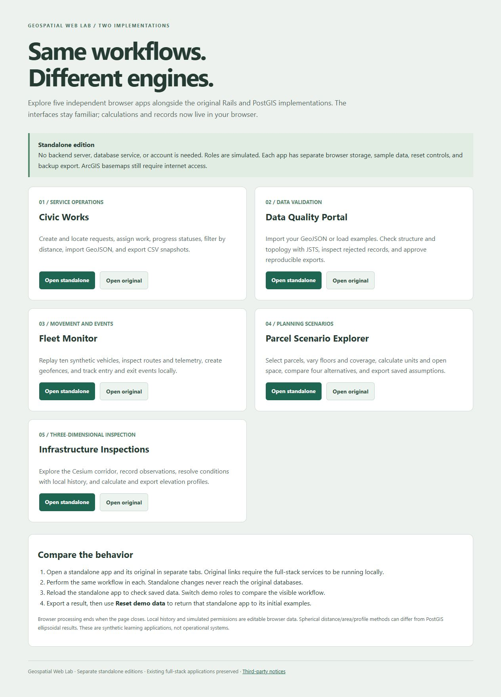
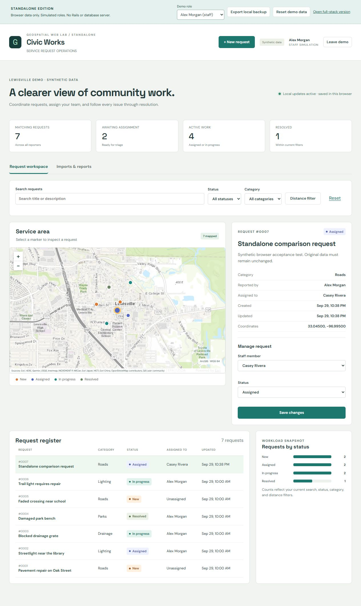
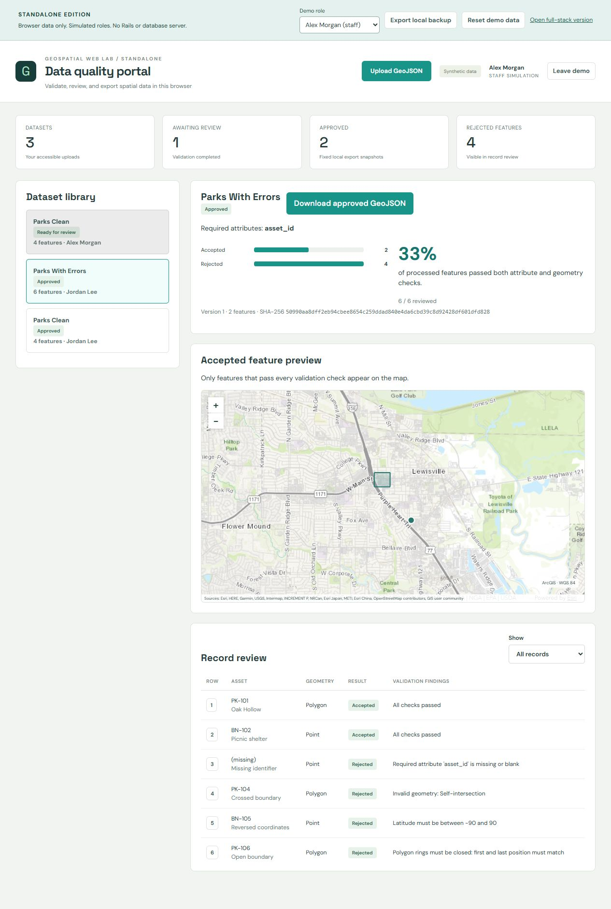
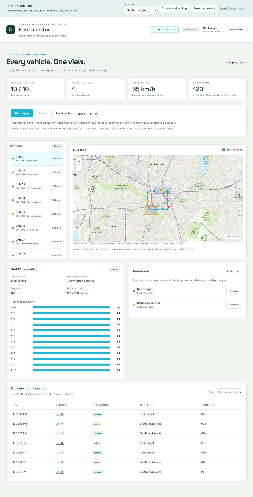
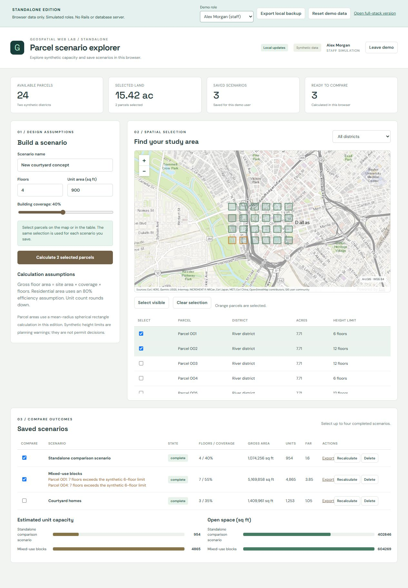
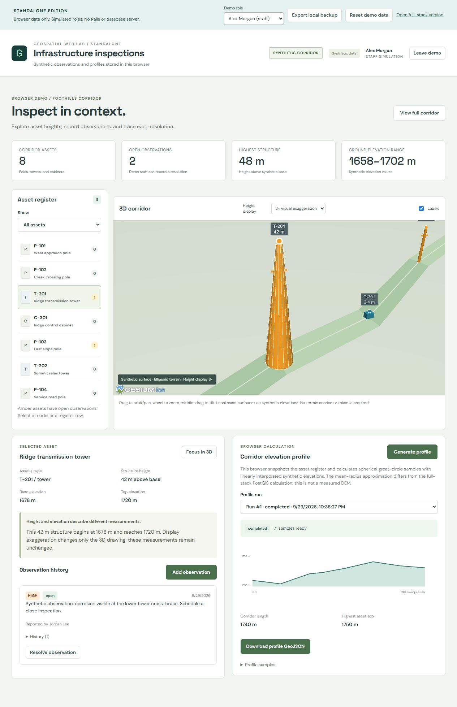

# Standalone verification record

Verified locally on September 29, 2026, using Windows, Node.js 24, and the Codex Chromium browser. The browser checks used production builds served from the comparison gallery at `http://127.0.0.1:5270/`, including each application's subdirectory.

## Original applications preserved

SHA-256 checks of all **371 previously tracked files** against the pre-conversion manifest found no changes. The standalone suite owns its source, dependencies, synthetic seed data, and browser databases. The new CI workflow is a separate file. No original Rails/database workflow was replaced.

## Automated verification

- **51 Node tests passed**, covering domain validation, ownership simulation, spatial calculations, stale edits, persistence, failed-write rollback, concurrency, replay leadership, local reset, and seven launcher/static-server regressions.
- **Seven interface tests passed**, covering role/session rendering, refreshed scenario/profile selections, and actual Blob download interception, contents, cleanup, and errors.
- All five applications build as static assets using relative paths.
- The single-app development command served its page and notices successfully. The combined production preview served the gallery, all five individual ports, and all five gallery subpaths. A slashless app URL redirected to the correct slash-terminated path while preserving its query string.
- `npm audit --audit-level=low` reported **zero known vulnerabilities** for the standalone lockfile on the verification date.
- The separate [standalone CI workflow](../.github/workflows/standalone.yml) runs installation, domain tests, interface tests, and all five production builds on Ubuntu with Node.js 24. Local results and CI results are separate evidence.

Run the commands in [README.md](README.md) to repeat the automated checks. A passing test suite does not establish complete browser compatibility or production readiness.

## Browser acceptance checks

| Application | Actions and observed result |
| --- | --- |
| Civic Works | Created a seventh request, assigned it to Casey Rivera, and reloaded. The request and assignment persisted. Generated and downloaded a CSV containing seven request rows. Downloaded a valid JSON backup of the local state. |
| Data quality portal | Reviewed a six-feature example with two accepted and four rejected records. Approved the accepted subset after acknowledging exclusions. Downloaded its two-feature GeoJSON and verified its exact SHA-256 against the displayed digest. Loaded the clean sample as the staff identity, obtaining four accepted features. Repeating that import reused the existing dataset. Switching to the reporter identity showed only its two datasets. |
| Fleet monitor | Ran ten synthetic vehicles at 4x, reached frame 120, paused, and reloaded. Frame 120, the selected speed, retained telemetry, and paused state survived. Routes, geofences, vehicle selection, speed bars, and entry/exit chronology rendered. |
| Parcel scenarios | Selected two parcels and calculated a four-floor, 40%-coverage scenario with a 900-square-foot unit assumption. The result contained 954 units, 1,074,256 square feet of gross floor area, and FAR 1.6. Compared it with the seeded mixed-use scenario, downloaded JSON, and verified the new scenario survived reload. |
| Infrastructure inspections | Rendered the Cesium corridor, selected a tower, focused the scene, and used 3x display exaggeration while the recorded height remained 42 metres. Created and resolved an observation with notes; its resolved status and two-event history survived reload. Generated a 71-sample profile and downloaded its GeoJSON. |

The downloaded approved dataset had SHA-256 `50990aa8dff2eb94cbee8654c259ddad840e4da6cbd39c8d92428df601dfd828`. Its export contained two accepted features. The profile export contained 71 features. CSV, scenario, profile, and backup downloads were read from actual browser-produced files and parsed successfully.

## Screenshots

These captures show synthetic acceptance-test data saved in the local gallery's browser origin. A fresh browser starts with the documented seed data, so counts and timestamps can differ. Each image is an actual application capture, not a mockup.

### Comparison gallery

### Civic Works

### Data quality portal

### Fleet monitor

### Parcel scenarios

### Infrastructure inspections

## Performance baseline (October 1, 2026)

`node scripts/benchmark.mjs` runs the real app adapters through the shared runtime and its IndexedDB storage. It uses fake-indexeddb in Node and reports the median of five runs. Inputs are built before timing starts. It was run on Linux with Node.js 22 on a cloud Intel Xeon 2.8 GHz container. Absolute times differ between machines and browsers.

### Record-level storage

Until this change, each app kept its whole state as one IndexedDB record. Every change cloned, rewrote and re-read that record, so save time grew with all stored data. A 1 KB Data Quality upload took about 2 s in Chromium once 30 MB were stored.

The storage now works differently:

- **Separate entries.** Each top-level field is stored separately. An array of records with unique ids is stored one IndexedDB entry per record.
- **In-memory state.** The runtime keeps the committed state in memory, frozen. Before each request it checks only the stored revision, and reloads only after another tab has written.
- **Copy-on-write drafts.** Handlers run on an [Immer](https://immerjs.github.io/immer/) draft. A change shares every untouched record with the committed state.
- **Small writes.** A save writes only the records and fields that changed, plus the revision. The same revision check still stops one tab from overwriting another's newer data.
- **Migration.** Databases from the previous layout are migrated when they are opened.

Current Node results:

| App | Operation | Data size | Stored state after the runs | Median |
| --- | --- | --- | ---: | ---: |
| 01 Civic Works | Create one request | 6 requests | 4 KB | 1.0 ms |
| 01 Civic Works | List with 1 km distance filter | 6 requests | 4 KB | 0.7 ms |
| 01 Civic Works | Import 500 point features | 6 requests | 745 KB | 47.4 ms |
| 01 Civic Works | Generate CSV export | 6 requests | 1,975 KB | 23.2 ms |
| 01 Civic Works | Create one request | 1000 requests | 371 KB | 1.5 ms |
| 01 Civic Works | List with 1 km distance filter | 1000 requests | 371 KB | 3.0 ms |
| 01 Civic Works | Import 500 point features | 1000 requests | 1,119 KB | 39.2 ms |
| 01 Civic Works | Generate CSV export | 1000 requests | 2,885 KB | 25.4 ms |
| 01 Civic Works | Create one request | 2500 requests | 929 KB | 2.8 ms |
| 01 Civic Works | List with 1 km distance filter | 2500 requests | 929 KB | 5.9 ms |
| 01 Civic Works | Generate CSV export | 2500 requests | 2,211 KB | 17.3 ms |
| 01 Civic Works | Create one request | 4500 requests | 1,672 KB | 6.0 ms |
| 01 Civic Works | List with 1 km distance filter | 4500 requests | 1,672 KB | 8.9 ms |
| 01 Civic Works | Generate CSV export | 4500 requests | 3,987 KB | 30.4 ms |
| 02 Data Quality | Validate upload | 500 polygons x 16 vertices (327 KB) | 1,037 KB | 117.8 ms |
| 02 Data Quality | Validate upload | 2000 polygons x 16 vertices (1311 KB) | 4,127 KB | 368.7 ms |
| 02 Data Quality | Validate upload | 2000 polygons x 64 vertices (4974 KB) | 15,114 KB | 1057.9 ms |
| 02 Data Quality | Small upload at the stored-upload budget | 4 datasets, 2 x 4.9 MB uploads | 30,286 KB | 2.1 ms |
| 03 Fleet Monitor | Replay tick (10 vehicles) | empty history | 27 KB | 4.2 ms |
| 03 Fleet Monitor | Replay tick (10 vehicles) | history at 360 points per vehicle | 549 KB | 14.1 ms |
| 04 Parcel Scenarios | Save one scenario | 2 saved scenarios | 17 KB | 1.0 ms |
| 04 Parcel Scenarios | Save one scenario | 102 saved scenarios | 192 KB | 1.3 ms |
| 04 Parcel Scenarios | Save one scenario | 302 saved scenarios | 542 KB | 1.8 ms |
| 04 Parcel Scenarios | Save one scenario | 2995 saved scenarios | 5,256 KB | 8.0 ms |
| 05 Inspections | Generate 71-sample profile | 0 stored profile runs | 47 KB | 1.5 ms |
| 05 Inspections | Generate 71-sample profile | 20 stored profile runs | 179 KB | 1.2 ms |

Chromium 141 spot check, with real IndexedDB and the same adapters loaded through the Vite development servers (medians of five runs, single runs for uploads and reopening):

| App | Operation | Data size | Whole-record storage | Record-level storage |
| --- | --- | --- | ---: | ---: |
| 02 Data Quality | Small upload | 2 x 4.9 MB uploads stored (30 MB state) | 2,083.9 ms | 2.8–5.2 ms |
| 02 Data Quality | First 2,000-polygon x 64-vertex upload (4.9 MB) | Seeded datasets only | 945.0 ms | 1,328.6–1,656.3 ms |
| 02 Data Quality | Open the app | 30 MB state | — | 479.8–1,021.2 ms |
| 04 Parcel Scenarios | Save one scenario | 595 saved scenarios | 268.0 ms | 7.2–17.8 ms |

Ranges are two separate runs. The first large upload is somewhat slower because the new dataset is frozen once as it enters the committed state.

### Limits

These limits remain:

- **Parcel scenarios:** at most 1,000 per demo user, raised from 200. Saves no longer depend on how many scenarios are stored, so this limit bounds browser storage and page-open time. Each user frees space by deleting their own scenarios.
- **Profile runs:** the newest 20 completed runs are kept. Failed or pending runs are kept so they can be retried, and the workspace lists the newest 10.
- **Data Quality Portal:** stored sources may total at most 10 MB, measured as compact JSON, with a 5 MB per-file limit. Each dataset stores its source, validated records and export snapshot, so stored state is about three times the source size. Changes are no longer slow at this size. The budget now bounds the time to open the app, which reads everything stored (about 0.5–1 s at 30 MB), and the memory the browser holds.

Civic Works caps requests (5,000), imports (100) and retained CSV exports (30). The Fleet Monitor caps history at 360 points per vehicle and 500 events. Geofences, inspection observations and their histories have no limit; they grow one user action at a time.

These numbers describe single-tab browser work on synthetic data. Full-stack measurements are in the [root verification record](../VERIFICATION.md#full-stack-performance-october-1-2026).

## Public deployment (October 1, 2026)

The standalone editions are published at [https://efkopru.github.io/geospatial-web-lab/](https://efkopru.github.io/geospatial-web-lab/) from `main` (commit `246bba4`). The [Publish standalone demo run](https://github.com/efkopru/geospatial-web-lab/actions/runs/36933360375) passed these steps:

- the domain and interface tests and all five builds
- a check of the built gallery through the local preview server
- the GitHub Pages deployment
- `verify-site.mjs` against the live URL: 29 URLs covering the gallery, all five apps, their bundled scripts, styles and icons, the Cesium assets, and the third-party notices and license copies

Its first deployment attempt failed because Pages had not been enabled. After the repository was made public and Pages was enabled with GitHub Actions as the source, rerunning the deploy job succeeded.

BROWSER_CHECK_PLACEHOLDER

## Scope of the evidence

The browser checks used locally served production files with internet access for ArcGIS resources. They did not publish GitHub Pages or test a desktop installer, complete offline operation, every device/browser combination, or operational GIS datasets. Simulated roles are not authentication. The mathematical differences from PostGIS and local-storage limits are documented in [COMPARISON.md](COMPARISON.md).
